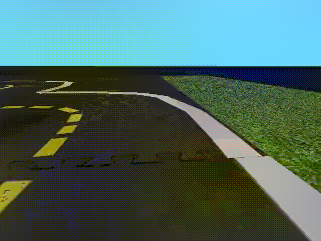
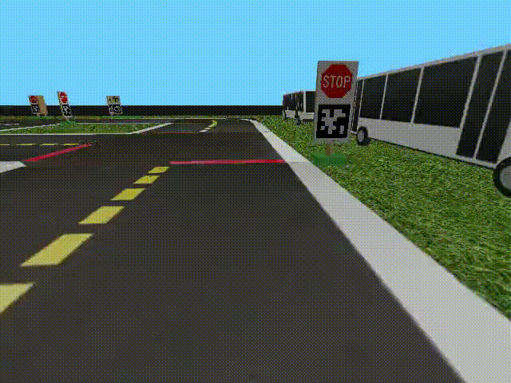
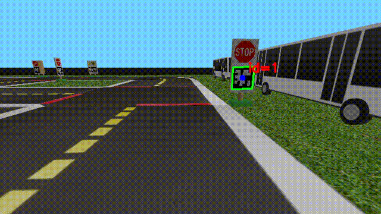

# Autonomous Driving of the Smart Car

Данный проект сделан в рамках проектной программы [Сириус.Лето](https://leto.sirius.online)

## Описание проекта

Сегодня автомобильная промышленность активно развивается, однако разработка систем автопилота всё ещё связана с рядом проблем. Тестирование алгоритмов в реальных условиях дорогое: ошибки могут привести к поломке автомобиля и необходимости повторных испытаний. Разработка также требует постоянного доступа к физическому роботу, что ограничивает возможность удаленной работы. Кроме того, перед каждым экспериментом необходимо настраивать и калибровать камеры, передачу данных и вычисления на устройстве, что усложняет и замедляет процесс разработки.

В данном проекте смоделированы условия городской среды для самостоятельного движения роботов-автомобилей с обеспечением безопасности их движения на основе открытого симулятора *gym-duckietown* [(ссылка)](https://github.com/duckietown/gym-duckietown)

## Установка проекта

Перед запуском проекта необходимо установить симулятор *gym-duckietown*. Инструкция по установке находится на официальном репозитории [Duckietown](https://github.com/duckietown/gym-duckietown).

Для установки зависимостей, используемых в проекте, необходимо воспользоваться следующей командой:
```bash
pip3 install -r requirements.txt 
```

Для того, чтобы склонировать репозиторий, можно вспользоваться следующей командой:
```bash
git clone https://github.com/moevm/DT_club_2025.git
```

Для запуска программы необходимо воспользоваться следующей командой:
```bash
python3 main.py
```

## Возможности проекта

В рамках проекта реализованы:

- Реализованы режимы ручного и авто-управления, разработаны алгоритмы автоматического поворота и движения по разметке;
- Удобное переключение видов камеры и управление;
- Реализована детекция желтой и серой разметки через маски с вычислением медианы;
- Автоматические движение вдоль линии разметки на основе сегментации линий;
- Автоматическая остановка при обнаружении стоп-линии по сегментации красного цвета;
- Сохранение результатов симуляции для последующей обработки и анализа работы алгоритмов;

## Демонстрация работы

Движение вдоль линии:
<div align="center">
  
</div>

Остановка перед стоп-линией:
<div align="center">
  
</div>

Детекция Apriltag-ов:
<div align="center">
  
</div>

Полное демо движения:
<div align="center">
  
</div>